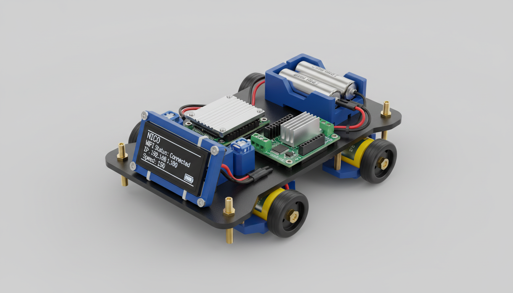
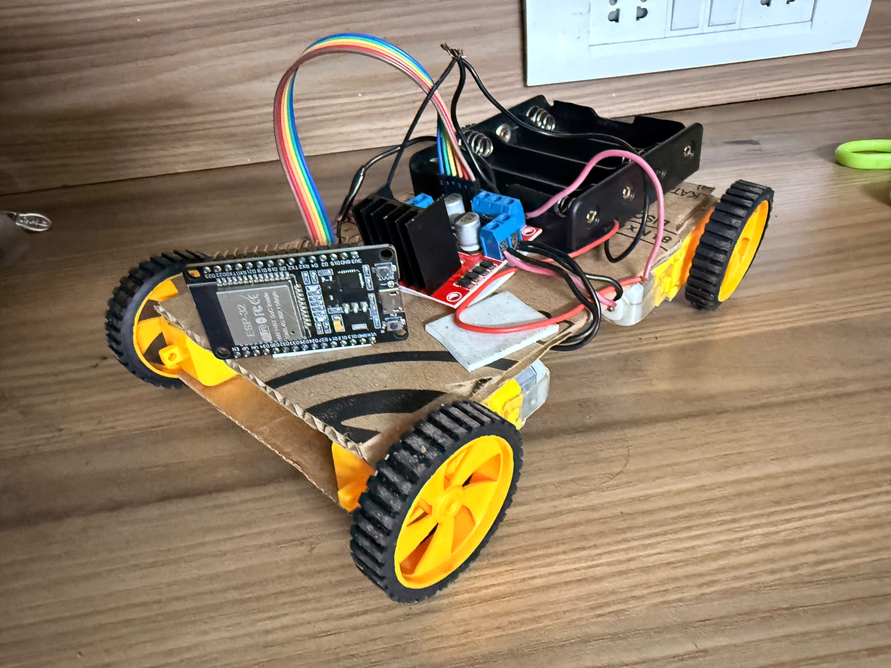
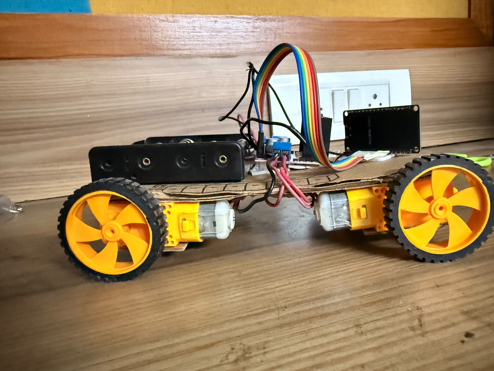
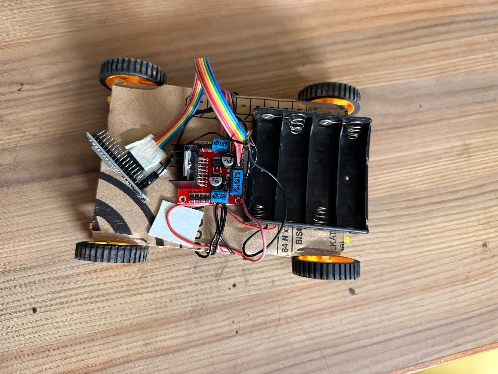
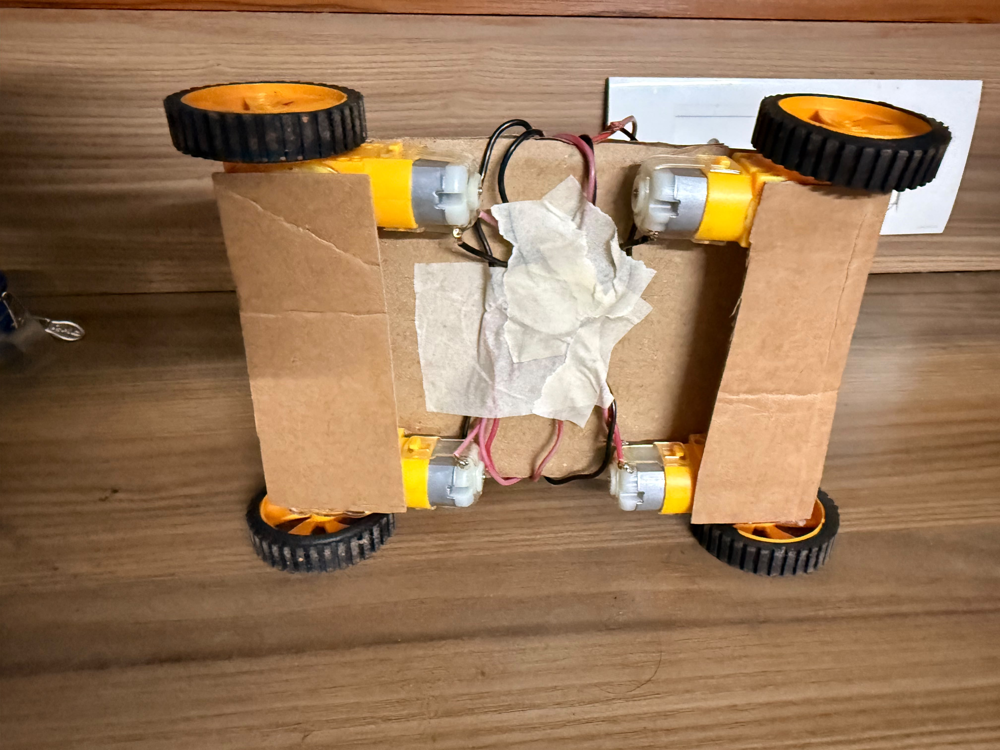
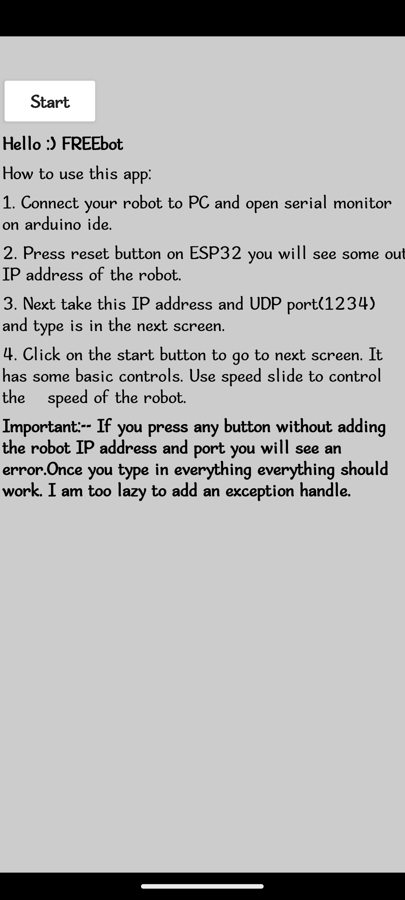
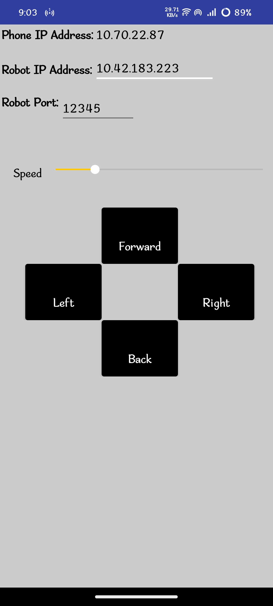
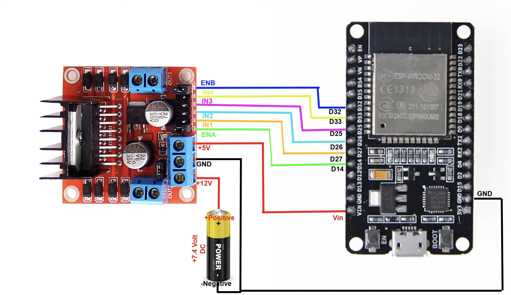

<div align="center">



# NICO OS

### Intelligent WiFi-Controlled Robotics Platform

**An Open-Source ESP32 Robotics Platform for Embedded Systems Learning and Rapid Prototyping**

<p>


</p>

<p>


</p>

### Designed & Developed by

## Zahid Khan • Indra Vamsi

*"Engineering ideas into intelligent machines."*

</div>

---

# 🚀 Project Status

| Item | Status |
|------|--------|
| Current Version | v1.0 |
| Development | Active |
| Firmware | Stable |
| Android App | Stable |
| Documentation | In Progress |
| Next Milestone | OLED + Autonomous Navigation |

---

# 📑 Quick Navigation

- [Abstract](#-abstract)
- [Motivation](#-motivation)
- [Features](#-key-features)
- [Hardware](#-hardware-components)
- [Software](#-software-stack)
- [Architecture](#-system-architecture)
- [Repository Structure](#-repository-structure)
- [Installation](#-installation)
- [Android Application](#-android-application)
- [Roadmap](#-future-roadmap)

---

# 📸 Robot Preview

<p align="center">



</p>

---

# 🎥 Live Demonstration

> A complete build and demonstration video will be available on YouTube.

📺 **Coming Soon**

---

# 📖 Abstract

Nico OS is an open-source WiFi-controlled robotic platform developed around the ESP32 microcontroller. The project demonstrates how embedded systems, wireless networking, and mobile software can be integrated into a modular robotic platform suitable for education, experimentation, and future autonomous robotics research.

Movement commands are transmitted from an Android application over a local WiFi network using UDP communication. The ESP32 receives these packets and controls an L298N motor driver, enabling responsive four-wheel drive motion with minimal latency.

Rather than being a one-time build, Nico OS is designed as an expandable robotics platform that will continue to evolve with additional sensing, navigation, and artificial intelligence capabilities.

---

# 🔬 Motivation

Robotics often appears inaccessible to beginners due to expensive hardware and complex software ecosystems.

Nico OS was created to demonstrate that a capable mobile robot can be built using affordable components while maintaining clean software architecture and room for future expansion.

The long-term vision is to transform Nico OS into a modular robotics platform supporting:

- Embedded Systems Learning
- IoT Applications
- Autonomous Navigation
- Computer Vision
- Artificial Intelligence
- Research and Rapid Prototyping

---

# 🎯 Objectives

- Build a reliable WiFi-controlled mobile robot.
- Develop a clean and modular firmware architecture.
- Design an Android controller application.
- Document the complete development process.
- Create a reusable robotics platform for future projects.

---

# ✨ Key Features

| Feature | Status |
|----------|:------:|
| ESP32 Based Controller | ✅ |
| WiFi Communication | ✅ |
| UDP Packet Control | ✅ |
| Android Controller | ✅ |
| Four Wheel Drive | ✅ |
| Modular Firmware | ✅ |
| Open Source | ✅ |
| OLED Status Display | 🔜 |
| Obstacle Avoidance | 🔜 |
| Bluetooth Mode | 🔜 |
| Voice Commands | 🔜 |
| Camera Streaming | 🔜 |
| AI Vision | 🔜 |
| GPS Navigation | 🔜 |

---

# ⚙ Hardware Components

| Component | Quantity |
|-----------|---------:|
| ESP32 Dev Module | 1 |
| L298N Motor Driver | 1 |
| BO Motors | 4 |
| Wheels | 4 |
| 18650 Li-ion Battery | 4 |
| Chassis | 1 |
| Power Switch | 1 |
| Android Smartphone | 1 |

---

# 💻 Software Stack

| Software | Purpose |
|-----------|---------|
| Arduino IDE | Firmware Development |
| ESP32 Arduino Core | Programming ESP32 |
| Blueprint.am | Android Application Development |
| GitHub | Version Control |
| GitHub Pages *(Future)* | Documentation Hosting |

---

# 🏗 System Architecture

```text
               Android Application
                       │
                 WiFi Network
                       │
               UDP Communication
                       │
                 ESP32 Controller
                       │
                 L298N Motor Driver
                 │               │
          Left Motors      Right Motors
```

---

# 📡 Communication Workflow

```text
Android App
      │
      ▼
Send UDP Command
      │
      ▼
WiFi Router
      │
      ▼
ESP32 Receives Packet
      │
      ▼
Command Decoder
      │
      ▼
Motor Driver
      │
      ▼
Robot Movement
```

---

# 📂 Repository Structure

```text
Nico-OS
│
├── app
│   ├── Android APK
│   ├── App Screenshots
│
├── docs
│   ├── Blueprint Files
│   ├── Documentation
│
├── firmware
│   ├── Nico_OS.ino
│
├── images
│   ├── Robot Images
│   ├── Circuit Diagram
│   ├── System Images
│
├── libraries
│   ├── DataParser
│
├── LICENSE
├── README.md
└── .gitignore
```

---

# 📥 Installation

## 1. Clone Repository

```bash
git clone https://github.com/zahidkh1/Nico-OS.git
```

---

## 2. Install Arduino IDE

Download the latest Arduino IDE and install the ESP32 board package.

---

## 3. Install Required Libraries

Install the following libraries:

- WiFi
- WiFiUDP
- DataParser
- ESP32 Arduino Core

---

## 4. Upload Firmware

Open:

```text
firmware/Nico_OS.ino
```

Select:

```text
Board:
ESP32 Dev Module
```

Compile and upload the firmware.

---

## 5. Configure WiFi

Edit the following variables in the source code:

```cpp
const char* ssid = "YOUR_WIFI_NAME";
const char* password = "YOUR_WIFI_PASSWORD";
```

Upload the modified firmware.

---

## 6. Power the Robot

Insert the battery pack.

Power on the ESP32 and motor driver.

Wait until the Serial Monitor displays:

```text
WiFi Connected
Robot Ready
```

---

# 📱 Android Application

The Android controller application is located inside:

```text
app/
```

Install the APK on an Android device.

Requirements:

- Android phone and ESP32 connected to the same WiFi network.
- UDP communication enabled.
- Correct IP address configured in the application.

Once connected, the application provides real-time directional control of Nico OS.

---

# 📊 Performance

The current version of Nico OS has been tested under indoor conditions using a local WiFi network.

| Parameter | Result |
|------------|----------|
| Communication Protocol | UDP |
| Wireless Range | ~20–30 meters (Indoor) |
| Average Response Time | < 50 ms |
| Controller Platform | Android |
| Power Source | 2 × 18650 Li-ion Batteries |
| Drive Configuration | 4WD |
| Firmware Size | ~450 KB |

---

# 🧪 Testing

The following functionality has been successfully tested.

| Test | Status |
|------|--------|
| ESP32 Boot | ✅ |
| WiFi Connection | ✅ |
| UDP Communication | ✅ |
| Android Controller | ✅ |
| Forward Movement | ✅ |
| Reverse Movement | ✅ |
| Left Turn | ✅ |
| Right Turn | ✅ |
| Emergency Stop | ✅ |
| Motor Driver Output | ✅ |

---

# 📷 Robot Gallery

## Front View

<p align="center">

</p>

---

## Side View

<p align="center">

</p>

---

## Top View

<p align="center">

</p>

---

## Bottom View

<p align="center">

</p>

---

# 📱 Android Controller

## Startup Screen

<p align="center">

</p>

---

## Main Controller

<p align="center">

</p>

---

## Application Logo

<p align="center">

</p>

---

# 🔌 Circuit Diagram

<p align="center">

</p>

---

# ⚡ Wiring Summary

| ESP32 Pin | L298N |
|------------|---------|
| GPIO27 | IN1 |
| GPIO26 | IN2 |
| GPIO25 | IN3 |
| GPIO33 | IN4 |
| GPIO14 | ENA |
| GPIO32 | ENB |
| GND | GND |

---

# 🧠 Firmware Overview

The firmware has been designed with modularity and simplicity in mind.

Major responsibilities include:

- WiFi Initialization
- UDP Communication
- Command Parsing
- Motor Driver Control
- Serial Debugging
- Safety Timeout

Future firmware releases will include:

- OLED Status Interface
- Obstacle Detection
- Autonomous Navigation
- OTA Updates
- AI Integration

---

# 📂 Project Modules

## Firmware

Responsible for

- WiFi
- UDP
- Motor Control
- Robot Logic

---

## Android Application

Responsible for

- User Interface
- Sending Commands
- Robot Connection

---

## Hardware

Responsible for

- Chassis
- Motor Driver
- ESP32
- Battery Management

---

## Documentation

Contains

- Images
- Circuit Diagrams
- Future Research
- Build Guide

---

# 🛣 Development Roadmap

## Version 1.0 ✅

- WiFi Robot
- Android App
- UDP Communication
- ESP32 Firmware
- GitHub Repository

---

## Version 2.0 🚧

- OLED Display
- Better UI
- Battery Indicator
- Speed Control
- OTA Firmware

---

## Version 3.0 🔬

- Ultrasonic Sensor
- Autonomous Mode
- Obstacle Avoidance
- PID Motion

---

## Version 4.0 🤖

- Camera Module
- AI Object Detection
- Computer Vision
- Live Video Streaming

---

## Version 5.0 🚀

- Voice Commands
- GPS Navigation
- Cloud Dashboard
- ROS Integration
- SLAM Mapping

---

# 🔮 Future Research

Nico OS has been intentionally designed as a research-oriented robotics platform.

Future research areas include

- Autonomous Mobile Robotics
- Artificial Intelligence
- Computer Vision
- Edge AI
- Swarm Robotics
- IoT Automation
- Indoor Navigation
- ROS2 Integration
- Reinforcement Learning
- Smart Agriculture Robotics

---

# 📚 Learning Outcomes

This project demonstrates practical implementation of

- Embedded Systems
- Robotics
- Wireless Networking
- Internet of Things
- Mobile Application Development
- Motor Driver Control
- ESP32 Programming
- UDP Networking
- Arduino Framework
- Git Version Control

---

# 🤝 Contributors

## 👨‍💻 Zahid Khan

**Project Lead**

Responsibilities

- Hardware Design
- Firmware Development
- Robot Assembly
- GitHub Documentation
- Testing
- Research

---

## 👨‍💻 Indra Vamsi

**Application Developer**

Responsibilities

- Android Application
- User Interface
- Communication Logic
- Application Testing
- System Integration

---

# 🎥 Project Demonstration

A complete build tutorial and demonstration video will be available on YouTube.

> 📺 **Coming Soon**

When available, replace this section with

```markdown
## Watch the Complete Build

[](https://youtu.be/YOUR_VIDEO_ID)
```

---

# 📈 Repository Statistics

If you like this project, consider

⭐ Starring the repository

🍴 Forking the project

🐛 Reporting issues

💡 Suggesting improvements

🤝 Contributing

---

# 📜 Citation

If you use Nico OS in your academic work or project, please cite

```text
Khan, Z., & Vamsi, I.
Nico OS: An Open-Source WiFi Controlled Robotics Platform Using ESP32.
GitHub Repository.
2026.
```

---

# 📄 License

This project is distributed under the MIT License.

See the LICENSE file for additional information.

---

# 🙏 Acknowledgements

Special thanks to

- Arduino Community
- Espressif Systems
- Open Source Contributors
- Blueprint.am
- GitHub
- Robotics Developer Community

whose tools and documentation greatly contributed to the development of Nico OS.

---

# 💙 Support the Project

If this repository helped you learn something new, please consider supporting the project by

⭐ Starring the repository

🍴 Forking the repository

📢 Sharing it with others

🛠 Contributing to future versions

---

<div align="center">

# NICO OS

### Engineering Ideas Into Intelligent Machines


---

### Built with ❤️ using

ESP32 • Arduino • C++ • Android • IoT

---

**Designed & Developed by**

# Zahid Khan • Indra Vamsi

---

*"The future belongs to those who build it."*

**Version 1.0**

© 2026 Nico OS Project

</div>
